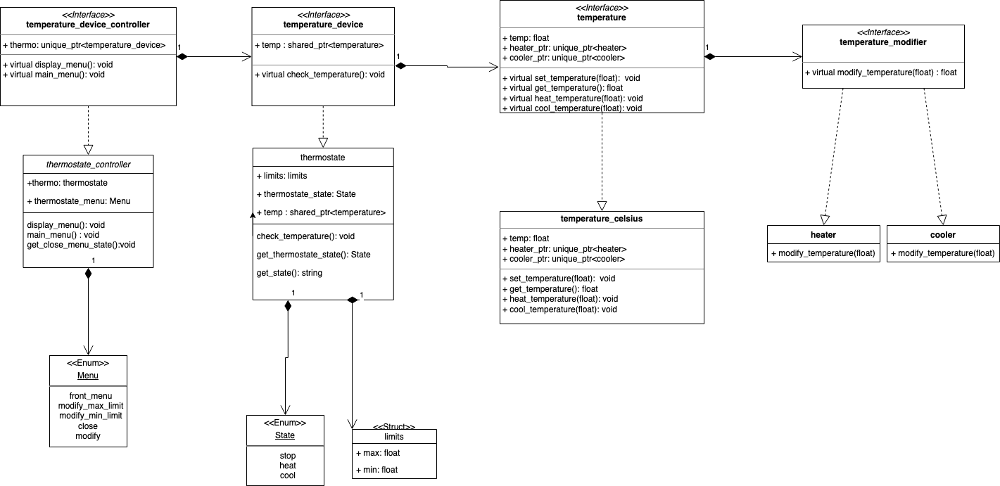

# Thermostate
Simple thermostate simulation. The application simulates the behaviour of a thermostate. It offers the user the possibility to custom the minimum and maximum temperature that he would like to have in a room. If the temperature is not in the define interval, the cooling or heating functions will be trigered so the temperature in the room will get in the needed interval.
The application offers a menu to control the the flow of it:
  - modify the maximum value of the range
  - modify the minimum value of the range
  - close the app
 
In case of modifications to the temperature admited range the thermostat will start bringing the temperature in the defined range. It does it by:
  - heating
  - cooling

<h2>Installation<h2>
  Run the following commands to clone the repo and build it
  
1. Clone the repo
   
  ```sh
   git clone https://github.com/xgrozasergiu/thermostate.git
   ```
  
2. Create build folder
  
  ```sh
  cd thermostate
  mkdir build
  cd build
  ```
  
3. Build using Cmake
  
  ```sh
   cmake ..
   make
   ```
  
<h2>Usage<h2>
Run the executable:
    
 ```sh
  ./thermostate 
  ```

  
<h2>Class diagram<h2>
  
